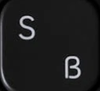

# Project Documentation: Custom Browser Homepage

This document provides a detailed explanation of the `index.html` file and the `style.css` stylesheet used to create a custom browser homepage. The page features a centered layout with a browser logo, a search bar, and a grid of pinned website links.

## 1. `index.html`

The `index.html` file defines the structure of the webpage using HTML. It creates a centered layout containing a browser logo, a search bar with a Google icon, and a list of pinned website links with images and names.

### Explanation

- **Document Setup**:
  - The `<!DOCTYPE html>` declaration specifies an HTML5 document.
  - The `<html lang="en">` tag sets the document language to English.
  - The `<head>` section includes:
    - `<meta charset="UTF-8">` to ensure Unicode character encoding.
    - `<meta name="viewport" content="width=device-width, initial-scale=1.0">` for responsive design, ensuring the page scales correctly on different devices.
    - `<title>Home Page</title>` to set the browser tab title.
    - `<link rel="stylesheet" href="./style.css">` to link the external `style.css` file for styling.
  - The `<body>` contains all visible content wrapped in a `<div class="container">`.

- **Content Structure**:
  - **Container**: The `.container` div serves as the main wrapper, centered on the page using CSS margins.
  - **Column**: Inside the `.container`, a `.column` div uses flexbox to arrange content vertically.
  - **Rows**: Three `.row` divs within `.column` use flexbox for horizontal layouts:
    1. **Branding Row**: Contains:
       - A `.brand` div with a browser logo (``), using a placeholder source (`chrome://branding/content/about-logo@2x.png`).
       - A `.brand-name` div with an `<h2 class="h2">` displaying the text "Firefox".
    2. **Search Bar Row**: Contains a `.search-bar` div with:
       - A `.google-searchbar` div holding a Google icon (``) sourced from `./gIcon.png`.
       - An input field (`<input type="text" class="search-bar-input">`) with a placeholder and title for accessibility.
    3. **Pinned Sites Row**: Contains a `<ul class="pinned-sites">` list with multiple `<li class="site">` elements, each representing a pinned site. Each site includes:
       - A `.site-icon` div with a linked image (``) wrapped in an `<a>` tag pointing to an external URL.
       - A `<span class="site-name">` for the site’s name.
       - Sites link to URLs like `https://www.chatgpt.com` and `https://www.pexels.com`, with images sourced from files like `./chatgpt.jpeg`, `s.jpg`, `s.png`, and `gIcon.png`.

- **Potential Issues**:
  - The `chrome://branding/content/about-logo@2x.png` is a browser-specific URL and may not work outside certain browser contexts.
  - Repeated use of `s.jpg` and other placeholder images (`s.png`, `gIcon.png`) may cause broken images if the files are not present or correctly pathed.
  - Links to `https://www.pexels.com/photo/photo-of-tabby-cat-3777622/` are repeated and may be placeholders, as they point to a specific image rather than a website homepage.

### Complete Code

```html
<!DOCTYPE html>
<html lang="en">
<head>
    <meta charset="UTF-8">
    <meta name="viewport" content="width=device-width, initial-scale=1.0">
    <title>Home Page</title>
    <link rel="stylesheet" href="./style.css">
</head>
<body>
    <div class="container">
        <div class="column">
            <div class="row">
                <div class="row-item brand">
                    
                </div>
                <div class="row-item brand-name">
                    <h2 class="h2">Firefox</h2>
                </div>
            </div>
            <div class="row">
                <div class="row-item row search-bar">
                    <div class="row-item google-searchbar">
                        
                    </div>
                    <div class="row-item">
                        <input type="text" class="search-bar-input" placeholder="Search with Google or enter address" title="Search with Google or enter address">
                    </div>
                </div>
            </div>
            <div class="row">
                <ul class="row-item row pinned-sites">
                    <li class="row-item site">
                        <div class="site-icon"><a href="https://www.chatgpt.com"></a></div>
                        <span class="site-name">chatgpt</span>
                    </li>
                    <li class="row-item site">
                        <div class="site-icon">
                            <a href="https://www.pexels.com/photo/photo-of-tabby-cat-3777622/">
                                
                            </a>
                        </div>
                        <span class="site-name">Overview</span>
                    </li>
                    <li class="row-item site">
                        <div class="site-icon">
                            <a href="https://www.pexels.com/photo/photo-of-tabby-cat-3777622/">
                                
                            </a>
                        </div>
                        <span class="site-name">Overview</span>
                    </li>
                    <li class="row-item site">
                        <div class="site-icon">
                            <a href="https://www.pexels.com/photo/photo-of-tabby-cat-3777622/">
                                
                            </a>
                        </div>
                        <span class="site-name">Overview</span>
                    </li>
                    <li class="row-item site">
                        <div class="site-icon">
                            <a href="https://www.pexels.com/photo/photo-of-tabby-cat-3777622/">
                                
                            </a>
                        </div>
                        <span class="site-name">Google</span>
                    </li>
                    <li class="row-item site">
                        <div class="site-icon">
                            <a href="https://www.pexels.com/photo/photo-of-tabby-cat-3777622/">
                                
                            </a>
                        </div>
                        <span class="site-name">S&B Developer</span>
                    </li>
                </ul>
            </div>
        </div>
    </div>
</body>
</html>

# Style.css Documentation

The `style.css` file provides the styling for a custom browser homepage defined in an associated `index.html` file. It uses CSS flexbox for layout, Google Fonts for typography, and visual effects like shadows and rounded corners to create a modern, centered design with a browser logo, search bar, and pinned website links.

## Explanation

- **Purpose**:
  - The stylesheet defines the visual appearance and layout of the homepage, ensuring elements are centered, properly spaced, and visually consistent.
  - It applies a light grayish-blue background, uses flexbox for responsive alignment, and adds effects like shadows and rounded corners for a polished look.

- **Key Features**:
  - **Font Import**: Imports multiple Google Fonts (Fira Sans, Oswald, Playwrite GB J Guides, Poppins) for typography, though only Oswald is used.
  - **Global Styles**: Resets margins and padding for all elements and sets a background color for the page.
  - **Layout**: Uses flexbox to arrange content in a centered column with rows for the logo, search bar, and pinned sites.
  - **Component Styling**: Applies specific styles for the browser logo, search bar, input field, and pinned site icons, with consistent use of shadows, borders, and rounded corners.

- **Detailed Breakdown**:
  - **Font Import**:
    - Uses `@import` to load Google Fonts with various weights and styles for Fira Sans, Oswald, Playwrite GB J Guides, and Poppins.
    - Only Oswald is used (for the `.h2` class), suggesting other fonts may be unused or intended for future use.
  - **Global Styles**:
    - `body`: Sets a background color of `#bac2ca` (light grayish-blue).
    - `*`: Resets `padding` and `margin` to `0` for all elements to ensure consistent spacing.
  - **Layout**:
    - `.container`: Centers content with `margin: 25vh 40vw`, positioning it 25% from the top and 40% from the sides of the viewport.
    - `.column` and `.row`: Use `display: flex` with `gap: 2rem` and `align-items: center` for consistent spacing and alignment.
      - `.column`: Sets `flex-direction: column` to stack children vertically.
      - `.row`: Sets `flex-direction: row` to arrange children horizontally.
    - `.row-item`: Removes default list styles (`list-style: none`) for `<li>` elements in the pinned sites list.
  - **Branding Styles**:
    - `.brand-image`: Sets the browser logo size to `5rem` by `5rem`.
    - `.h2`: Styles the browser name text (e.g., "Firefox") with:
      - `font-family: "Oswald", sans-serif` for a bold, modern font.
      - `font-size: 5vw` for responsive scaling based on viewport width.
      - `letter-spacing: 0.1rem` for slight character spacing.
      - `margin: 1.25rem` for spacing around the text.
      - `font-optical-sizing: auto` and `font-style: normal` for optimal font rendering.
  - **Search Bar Styles**:
    - `.search-bar`: Styles the search bar container with:
      - `background-color: white` and `opacity: 0.75` for a semi-transparent effect.
      - `box-shadow: 0.2rem 0.2rem 0.9rem black` for a subtle shadow.
      - `border-radius: 1rem` for rounded corners.
      - `padding: 0.5rem` and `width: 21rem` for consistent sizing.
      - `gap: 0` to override the default `2rem` gap for tighter alignment of the icon and input.
    - `.google-icon`: Sets the Google icon size to `2rem` by `2rem`.
    - `.search-bar-input`: Styles the input field with:
      - `width: 18rem` and `height: 1.5rem` for size.
      - `border: white solid` for a clean border.
      - `border-radius: 1rem` for rounded corners.
      - `margin: 0.15rem` for slight spacing.
  - **Pinned Sites Styles**:
    - `.site-image`: Sets site icons to `6rem` by `6rem` with a white border and `border-radius: 3rem` for a circular appearance.
    - `.site-icon`: Styles the icon container with:
      - `background: white` for a clean background.
      - `box-shadow: 0.2rem 0rem 0.2rem black` for a subtle shadow.
      - `padding: 1rem` for internal spacing.
      - `border-radius: 1rem` for rounded corners.
    - `.site`: Centers text for site names using `text-align: center`.

- **Potential Issues**:
  - The `margin: 25vh 40vw` on `.container` may cause content to be off-screen on smaller devices, requiring media queries for responsiveness.
  - The `5vw` font size for `.h2` may lead to inconsistent text sizes across different screen sizes.
  - Unused fonts (Fira Sans, Playwrite GB J Guides, Poppins) increase load time and could be removed to optimize performance.
  - The fixed `21rem` width for `.search-bar` may not adapt well to smaller screens, potentially causing overflow.

## Complete Code

```css
@import url('https://fonts.googleapis.com/css2?family=Fira+Sans:ital,wght@0,100;0,200;0,300;0,400;0,500;0,600;0,700;0,800;0,900;1,100;1,200;1,300;1,400;1,500;1,600;1,700;1,800;1,900&family=Oswald:wght@200..700&family=Playwrite+GB+J+Guides:ital@0;1&family=Poppins:ital,wght@0,100;0,200;0,300;0,400;0,500;0,600;0,700;0,800;0,900;1,100;1,200;1,300;1,400;1,500;1,600;1,700;1,800;1,900&display=swap');

body {
    background: #bac2ca;
}
* {
    padding: 0;
    margin: 0;
}
.container {
    margin: 25vh 40vw;
}
.column, .row {
    display: flex;
    gap: 2rem;
    align-items: center;
}
.column {
    flex-direction: column;
}
.row {
    flex-direction: row;
}
.brand-image {
    height: 5rem;
    width: 5rem;
}
.google-icon {
    height: 2rem;
    width: 2rem;
}
.h2 {
    margin: 1.25rem;
    font-family: "Oswald", sans-serif;
    font-optical-sizing: auto;
    font-style: normal;
    font-size: 5vw;
    letter-spacing: 0.1rem;
}
.search-bar {
    gap: 0;
}
.search-bar-input {
    margin: 0.15rem;
    width: 18rem;
    height: 1.5rem;
    border: white solid;
    border-radius: 1rem;
}
.search-bar {
    background-color: white;
    opacity: 0.75;
    box-shadow: 0.2rem 0.2rem 0.9rem black;
    border-radius: 1rem;
    padding: 0.5rem;
    width: 21rem;
}
.site-image {
    height: 6rem;
    width: 6rem;
    border: white solid;
    border-radius: 3rem;
}
.row-item {
    list-style: none;
}
.site-icon {
    background: white;
    box-shadow: 0.2rem 0rem 0.2rem black;
    padding: 1rem;
    border-radius: 1rem;
}
.site {
    text-align: center;
}